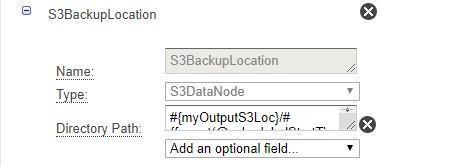
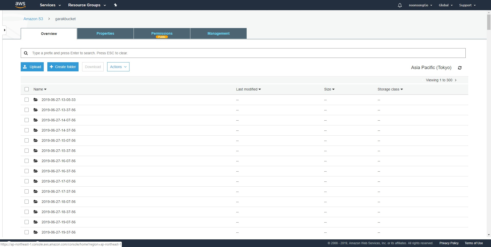
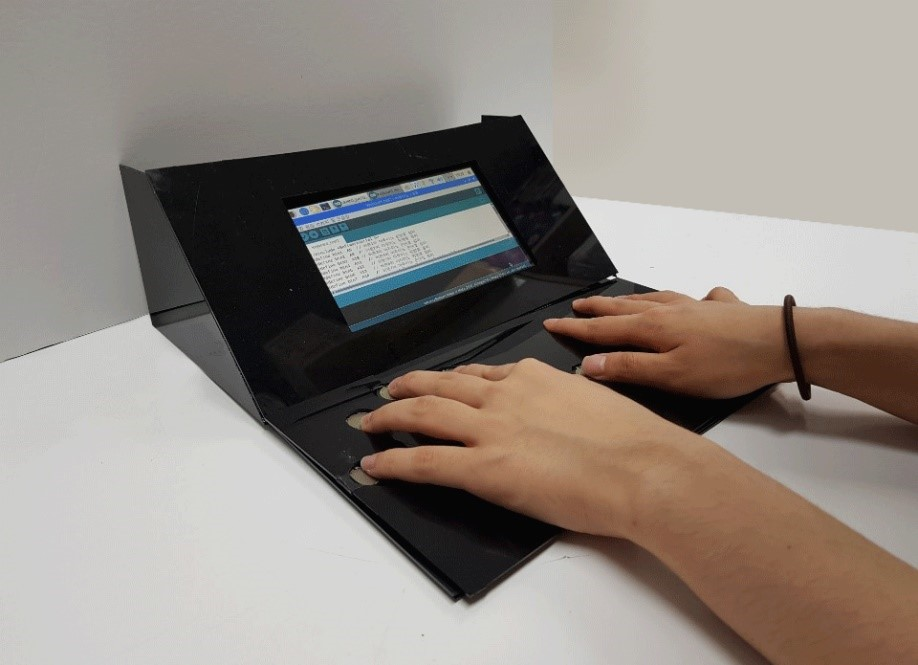

# Garak(IoT Device)
아두이노 + 압력센서 + 라즈베리파이 + AWS를 사용한 노인 손가락 재활치료를 돕는 피아노 제품

#아두이노(uno or mega)로 센싱한 데이터를 AWS에 올리는 방법은? 
라즈베리파이를 통해 .py파일로 data DynamoDB에 저장
#AWS활용하기: 센싱한 데이터를 어떻게 가공할까? 
AWS data pipeline + AWS quicksight

아두이노로 피아노를 만드는데 필요한 아두이노 코드 작성과 회로작업, 압력 값을 클라우드로 올리기 위한 파이썬 코드 작성, 그리고 AWS개발을 하며 배운 점이 많았던 프로젝트다. 
먼저, 하드웨어부분에서 아두이노를 1년간 다뤄봤기 때문에 수월하게 코드를 짜고 연결할 수 있었다. 하지만, 아두이노Yun이 아닌 아두이노Uno로 센싱한 데이터를 클라우드에 올리는 것은 학교내 특강에서도 성공한 적이 없다고 해 오기가 생겼다. 조금 복잡하지만, 너무 비싼 Yun 대신 Uno를 사용해 클라우드에 올리는 architecture를 설계했다. 
소프트웨어부분에서는 AWS Architecture 수업을 들으면서 배웠던 서비스들에 대한 지식을 바탕으로 인터넷과 책을 찾아가면서 발전시키고 활용하였다. 특히 4학기에 진행한 ‘아두이노 피아노 프로젝트’에 AWS를 사용해 실제로 서비스 가능한 제품을 만들어 보고 싶어 시작한 만큼 의지가 강했다. 한글로 정리해놓은 글도 거의 없고, 정말 좋은 서비스지만 어려워서 사용을 하지 않는 경우가 많았기 때문에 최대한 인터넷과 유투브에 나와있는 정보와 배웠던 AWS Architecture 수업자료 등을 활용해 성공적으로 Hardware device의 sensing data처리, 데이터베이스와의 연동, 그 데이터로 그래프 시각화까지 마무리할 수 있었다. 
이번 기회로 IoT와 AWS에 더 많은 흥미가 생긴 것 같다. 다음은 realtime으로 만들어봐야겠다.

#앞으로 계획
 -UN citypreneurs참가
 -Real-Time Data Stream(향후 목표 AWS Kinesis & Lambda & Kibana사용)

<HardWare>

아두이노Uno에 MusicShield를 부착, 압력센서를 누르면 압력값을 받아들이고 동시에 피아노 소리를 스피커로 내보낸다. 그리고 아두이노와 연결된 라즈베리파이로 압력값이 들어오는 것을 볼 수 있다. 
2학년때부터 학습했던 아두이노 공부를 토대로 sensor와 아두이노연결, 그리고 Arduino uno의 serial2핀과 music shield의 통신핀을 선으로 연결하는 전자회로적 지식도 필요했다.

<SoftWare> 
<라즈베리파이에서 .py 파이썬파일 생성, 실행 Arduino -> DynamoDB>
MQTT통신 // 코드는 RPI2AWS.py참조

<DynamoDB생성 - 열손가락 압력값 & timestamp 저장목적>

<IoTCore – 사물 myPSP_Policy>
{
  "Version": "2012-10-17",
  "Statement": [
    {
      "Effect": "Allow",
      "Action": [
        "iot:Publish",
        "iot:Receive"
      ],
      "Resource": [
        "arn:aws:iot:ap-northeast-1:626387332077:topic/sdk/test/java",
        "arn:aws:iot:ap-northeast-1:626387332077:topic/sdk/test/Python",
        "arn:aws:iot:ap-northeast-1:626387332077:topic/topic_1",
        "arn:aws:iot:ap-northeast-1:626387332077:topic/topic_2",
        "arn:aws:iot:ap-northeast-1:626387332077:topic/myPSP"
      ]
    },
    {
      "Effect": "Allow",
      "Action": [
        "iot:Subscribe"
      ],
      "Resource": [
        "arn:aws:iot:ap-northeast-1:626387332077:topicfilter/sdk/test/java",
        "arn:aws:iot:ap-northeast-1:626387332077:topicfilter/sdk/test/Python",
        "arn:aws:iot:ap-northeast-1:626387332077:topicfilter/topic_1",
        "arn:aws:iot:ap-northeast-1:626387332077:topicfilter/topic_2",
        "arn:aws:iot:ap-northeast-1:626387332077:topicfilter/myPSP"
      ]
    },
    {
      "Effect": "Allow",
      "Action": [
        "iot:Conn
ect"
      ],
      "Resource": [
        "arn:aws:iot:ap-northeast-1:626387332077:client/sdk-java",
        "arn:aws:iot:ap-northeast-1:626387332077:client/basicPubSub",
        "arn:aws:iot:ap-northeast-1:626387332077:client/sdk-nodejs-*",
        "arn:aws:iot:ap-northeast-1:626387332077:client/myPSP"
      ]
    }
  ]
}

<IoTCore act – Rules>

Sql 문 작성 -> Action 선택(미리 dynamodb만들어 놓으면 Sensing Data가 아두이노->라즈베리파이(파이썬)->aws IoTCore -> DynamoDB 순으로 저장됨)

<Datapipeline구성>

<S3에 저장된 DATA가 잘 들어왔나 확인>

	주의: Public bucket으로 설정해야 quicksight로 그래프 구성가능

datapipeline에서 schedule된 시간이되면 s3로 DynamoDB table 복사(저장)

<Quicksight로 그래프그리기>

여러 그래프들을 그릴 수 있다.

S3 import JSON in Quick Sight 
여기서 JSON파일과 S3버킷 urn이 필요하다. JSON파일은 작성필요

<제품 프로토타입>

<실제로  만든 프로토타입>

<모델링 프로토타입>

-끝-